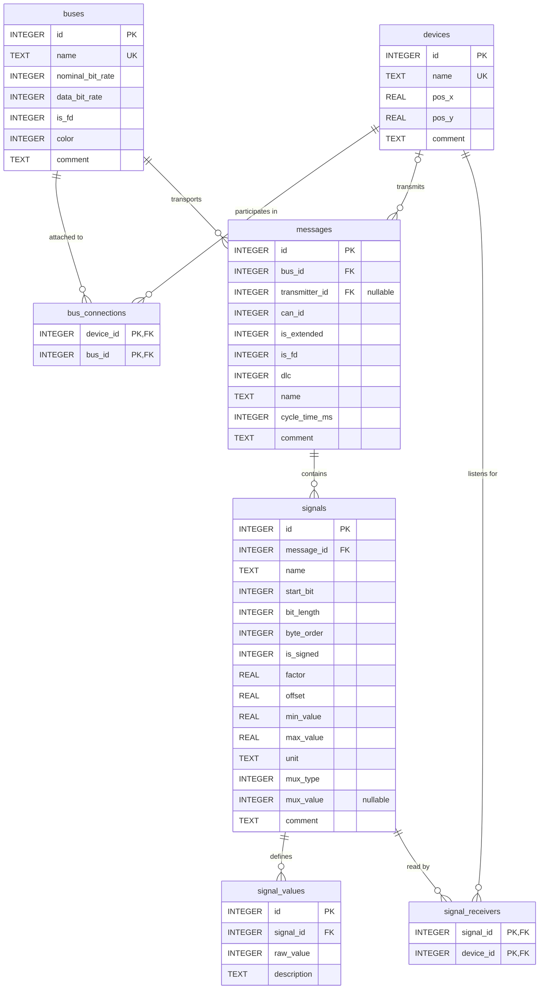

```mermaid
erDiagram
    devices ||--o{ bus_connections : "participates in"
    buses   ||--o{ bus_connections : "attached to"

    buses   ||--o{ messages : "transports"
    devices |o--o{ messages : "transmits"

    messages ||--o{ signals : "contains"

    signals ||--o{ signal_values : "defines"

    signals ||--o{ signal_receivers : "read by"
    devices ||--o{ signal_receivers : "listens for"

    devices {
        INTEGER id PK
        TEXT    name UK
        REAL    pos_x
        REAL    pos_y
        TEXT    comment
    }

    buses {
        INTEGER id PK
        TEXT    name UK
        INTEGER nominal_bit_rate
        INTEGER data_bit_rate
        INTEGER is_fd
        INTEGER color
        TEXT    comment
    }

    bus_connections {
        INTEGER device_id PK, FK
        INTEGER bus_id    PK, FK
    }

    messages {
        INTEGER id PK
        INTEGER bus_id FK
        INTEGER transmitter_id FK "nullable"
        INTEGER can_id
        INTEGER is_extended
        INTEGER is_fd
        INTEGER dlc
        TEXT    name
        INTEGER cycle_time_ms
        TEXT    comment
    }

    signals {
        INTEGER id PK
        INTEGER message_id FK
        TEXT    name
        INTEGER start_bit
        INTEGER bit_length
        INTEGER byte_order
        INTEGER is_signed
        REAL    factor
        REAL    offset
        REAL    min_value
        REAL    max_value
        TEXT    unit
        INTEGER mux_type
        INTEGER mux_value "nullable"
        TEXT    comment
    }

    signal_values {
        INTEGER id PK
        INTEGER signal_id FK
        INTEGER raw_value
        TEXT    description
    }

    signal_receivers {
        INTEGER signal_id PK, FK
        INTEGER device_id PK, FK
    }
```
